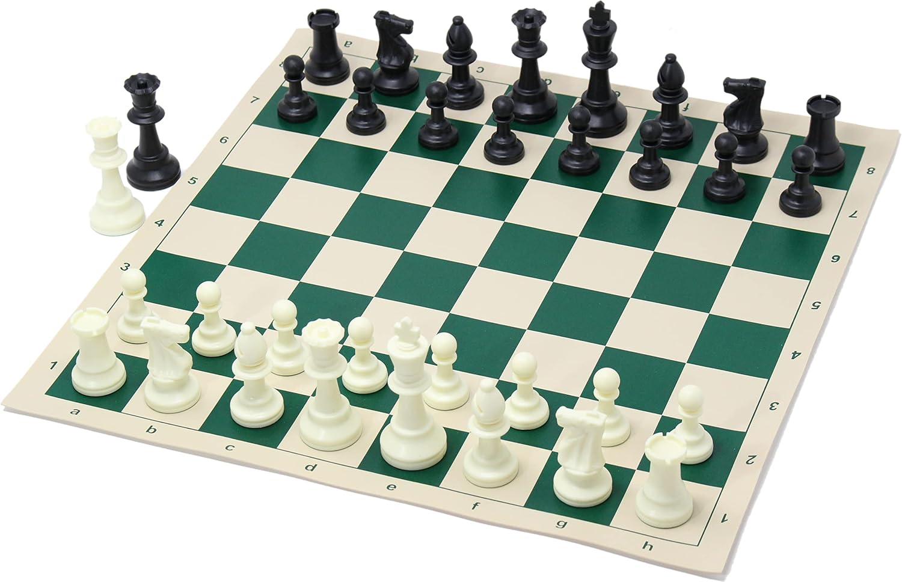
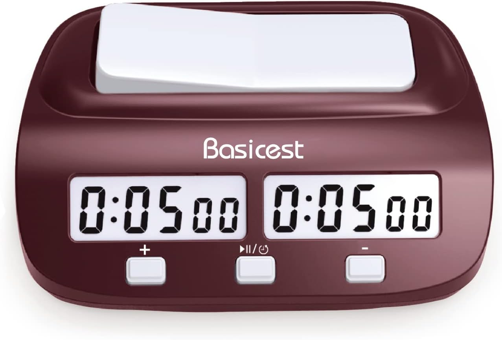

<!DOCTYPE html>
<html lang="ja">
<head>
  <meta charset="UTF-8" />
  <meta name="viewport" content="width=device-width, initial-scale=1.0" />
  <title>蒲田チェスクラブ | 蒲田で初心者歓迎のチェスサークル</title>
  <meta name="description" content="蒲田チェスクラブは、蒲田駅近くで毎月金曜に活動する初心者歓迎のチェスサークルです。地域最大級のアットホームなクラブで、誰でも気軽にチェスを楽しめます。見学自由！">
  <meta property="og:title" content="蒲田チェスクラブ｜初心者歓迎！" />
  <meta name="keywords" content="蒲田チェス, 蒲田チェスクラブ, チェス 大田区, チェスクラブ 初心者, Kamata Chess Club" />
  <meta property="og:description" content="蒲田駅近くで毎月活動中。誰でも参加OKのチェスクラブです。" />
  <meta property="og:image" content="https://tsutayuki.github.io/kamata.chess.club/ogp.jpg" />
  <meta property="og:url" content="https://tsutayuki.github.io/kamata.chess.club/" />
  <meta property="og:type" content="website" />
  <meta name="twitter:card" content="summary_large_image" />
  <meta name="google-site-verification" content="qWTbGYtlpMc3IByDY8rByehlV5YYwZ8DpcqPtnNfhJw" />
  
  
</head>
<body class="bg-white text-gray-800 font-sans">

  <!-- Heroセクション -->
  <section class="relative h-screen w-full overflow-hidden">
    
    

    

      <h1 class="text-4xl md:text-6xl font-bold mb-4 drop-shadow-lg">
        蒲田チェスクラブで対局しよう
      </h1>
      
毎月金曜日、誰でも参加OK

      <a href="#schedule" class="bg-white text-black px-6 py-3 rounded-full text-lg font-semibold hover:bg-gray-200 transition">
        次回の予定を見る
      </a>
    

  </section>

  <!-- クラブ紹介 -->
  <section class="py-16 px-6 max-w-3xl mx-auto text-center" id="about">
    <h2 class="text-3xl font-bold mb-4">蒲田チェスクラブとは？</h2>
    

      学生から社会人まで、誰でも気軽に参加できるチェスクラブです。 
      毎月金曜日(1回500円)、大田区蒲田周辺で活動中。初心者大歓迎！ 
      楽しみながらチェスを学び、仲間と成長できます。
    

    
📷 活動の様子は <a href="https://x.com/kamata_chess" class="text-blue-600 underline hover:text-blue-800">twitter(現X)</a> にて更新中！

  </section>

  <!-- チェスルール動画紹介 -->
  <section class="py-16 px-6 max-w-3xl mx-auto text-center" id="rules">
    <h2 class="text-3xl font-bold mb-4">♟ チェスのルール解説動画</h2>
    

      初心者向けに基本ルールがわかりやすく解説された動画です。 
      (初心者向けチェス講師 上原先生の動画となります。)
    

    
    

      <iframe width="100%" height="400"
              src="https://www.youtube.com/embed/jX2H_A6teCY"
              title="チェスのルール解説動画1"
              frameborder="0"
              allow="accelerometer; autoplay; clipboard-write; encrypted-media; gyroscope; picture-in-picture"
              allowfullscreen>
      </iframe>
    

    

      <iframe width="100%" height="400"
              src="https://www.youtube.com/embed/Og_G1Ds8fk8?si=OwHpartDN8dVFTm3"
              title="チェスのルール解説動画2"
              frameborder="0"
              allow="accelerometer; autoplay; clipboard-write; encrypted-media; gyroscope; picture-in-picture"
              allowfullscreen>
      </iframe>
    

    

      <iframe width="100%" height="400"
              src="https://www.youtube.com/embed/4bNOdDHYYL4?si=1TAfJ6rhQApYX1Dl"
              title="チェスのルール解説動画3"
              frameborder="0"
              allow="accelerometer; autoplay; clipboard-write; encrypted-media; gyroscope; picture-in-picture"
              allowfullscreen>
      </iframe>
    

  </section>

  <!-- 活動予定 -->
  <section class="bg-gray-100 py-16 px-6" id="schedule">
    

      <h2 class="text-3xl font-bold mb-6">🗓 活動予定</h2>
      <ul class="text-lg space-y-4">
        <li>📅 <strong>(💡次回)8月22日（金）18:00〜22:00</strong> @ 新蒲田区民活動施設</li>
        <li>📅 <strong>9月12日（金）18:00〜22:00</strong> @ 新蒲田区民活動施設</li>
         
        <h3 class="text-3xl mb-6">🗓 活動終了</h2>
        <li>📅 （終了）7月11日（金）18:00〜22:00 @ 新蒲田区民活動施設</li>
      </ul>
    

  </section>
  
    <!-- アクセス -->
  <section class="bg-gray-100 py-16 px-6" id="access">
    

      <h2 class="text-3xl font-bold mb-6">📍 アクセス</h2>
        

          主な活動場所は「新蒲田区民活動施設」(別名：カムカム新蒲田)です。 
          JR蒲田駅西口より徒歩7分。建物の2階にあります。
        

        

          <iframe class="w-full h-full"
                  src="https://www.google.com/maps/embed?pb=!1m18!1m12!1m3!1d6491.603638025585!2d139.70553071467847!3d35.558596390051086!2m3!1f0!2f0!3f0!3m2!1i1024!2i768!4f13.1!3m3!1m2!1s0x601861fcba2c7001%3A0x8f9aa8ee2fbe011a!2z44Kr44Og44Kr44Og5paw6JKy55Sw!5e0!3m2!1sja!2sjp!4v1752248506546!5m2!1sja!2sjp"
                  frameborder="0">
          </iframe>
        

      

  </section>

  <!-- お問い合わせ -->
  <section class="py-16 px-6 max-w-3xl mx-auto text-center" id="contact">
    <h2 class="text-3xl font-bold mb-4">📩 お問い合わせ</h2>
    
見学希望・ご質問など、お気軽にどうぞ。

    <a href="https://docs.google.com/forms/d/1H5A2Gcat4hG5h4h7RaIVEuB17KGYdKOIeGYmRLx1zPw/edit" target="_blank" class="inline-block bg-blue-600 text-white px-6 py-3 rounded-full font-semibold hover:bg-blue-700 transition">
      フォームを開く
    </a></section>

  <!-- 代表者紹介 -->
  <section class="py-16 px-6 max-w-3xl mx-auto text-center" id="leader">
    <h2 class="text-3xl font-bold mb-4">👤 代表紹介</h2>
    

      
      
donta

      

        蒲田チェスクラブ代表。 
        チェス歴15年／FIDEレート1938。 
        慶應義塾大学卒業。 
        初心者から上級者まで楽しめるクラブ作りを目指しています。 
        普段はITエンジニア。
      

    

  </section>

  <section class="py-16 px-6 max-w-3xl mx-auto text-center">
  <h2 class="text-3xl font-bold mb-4">💰 おすすめチェス商品</h2>
    

      <h2 class="text-2xl font-bold mb-4">ChessJapan 日本チェス連盟公認 チェスセット</h2>
      <a href="https://amzn.to/4luFS6S" target="_blank" rel="nofollow noopener noreferrer">
        
        
購入する

      </a>
      

        ChessJapanの日本チェス連盟公認チェスセットです。蒲田チェスクラブでも用いています。
      

    

      
    

      <h2 class="text-2xl font-bold mb-4">チェスクロック Basicest製</h2>
      <a href="https://amzn.to/40RdAef" target="_blank" rel="nofollow noopener noreferrer">
        
        
購入する

      </a>
      

        チェスクロックです。蒲田チェスクラブでも用いています。
      

    

</section>

  <!-- フッター -->
  <footer class="bg-black text-white text-center py-6">
    
© 2025 蒲田チェスクラブ

    

      <a href="https://x.com/kamata_chess" class="underline hover:text-gray-300 mx-2">twitter(現X)</a>
    

  </footer>

</body>
</html>
